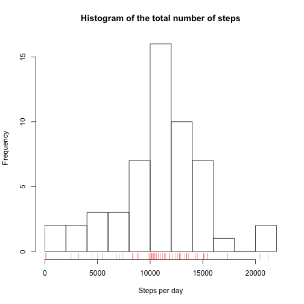
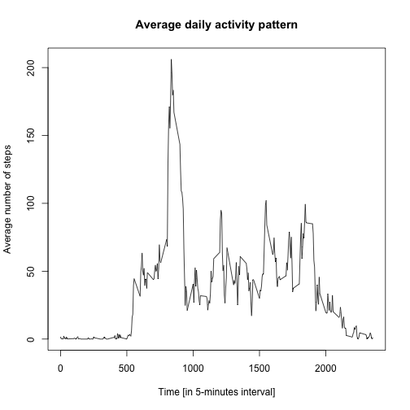
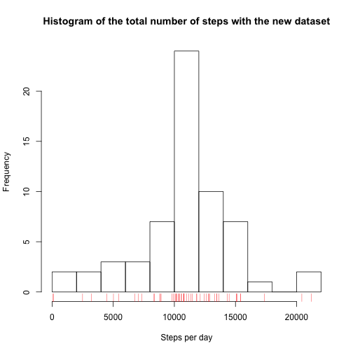
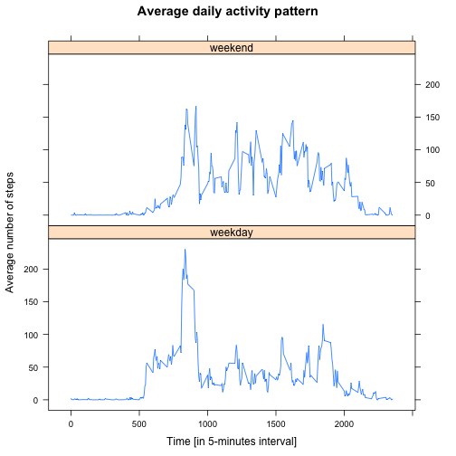

## Reproducible Research: Course Project

### Loading and preprocessing the data

- Load libraries

```r
library(plyr)
library(dplyr)
library(lattice)
```

- Load the data

```r
data <- read.csv("activity.csv", header = TRUE, sep = ",", na.strings = "NA")
str(data)
```

```
## 'data.frame':	17568 obs. of  3 variables:
##  $ steps   : int  NA NA NA NA NA NA NA NA NA NA ...
##  $ date    : Factor w/ 61 levels "2012-10-01","2012-10-02",..: 1 1 1 1 1 1 1 1 1 1 ...
##  $ interval: int  0 5 10 15 20 25 30 35 40 45 ...
```

- Process/transform the data (if necessary) into a format suitable for your analysis

```r
data$date <- as.Date(data$date)
str(data)
```

```
## 'data.frame':	17568 obs. of  3 variables:
##  $ steps   : int  NA NA NA NA NA NA NA NA NA NA ...
##  $ date    : Date, format: "2012-10-01" "2012-10-01" ...
##  $ interval: int  0 5 10 15 20 25 30 35 40 45 ...
```

### What is mean total number of steps taken per day?

- Calculate the total number of steps taken per day, by ignoring the missing values

```r
data_StepsDay <- na.omit(data) %>%
        group_by(date) %>%
        summarise(steps=sum(steps)) %>%
        as.data.frame()
head(data_StepsDay)
```

```
##         date steps
## 1 2012-10-02   126
## 2 2012-10-03 11352
## 3 2012-10-04 12116
## 4 2012-10-05 13294
## 5 2012-10-06 15420
## 6 2012-10-07 11015
```

```r
tail(data_StepsDay)
```

```
##          date steps
## 48 2012-11-24 14478
## 49 2012-11-25 11834
## 50 2012-11-26 11162
## 51 2012-11-27 13646
## 52 2012-11-28 10183
## 53 2012-11-29  7047
```

- If you do not understand the difference between a histogram and a barplot, research the difference between them.

```r
?hist
?barplot
```

- Make a histogram of the total number of steps taken each day

```r
hist(data_StepsDay$steps, breaks = 10, xlab = "Steps per day", 
     main = "Histogram of the total number of steps")
rug(data_StepsDay$steps, col='red')
```



- Calculate and report the mean and median of the total number of steps taken per day

```r
options(scipen = 5, digits = 2) 
mean_StepsDay <- mean(data_StepsDay$steps)
median_StepsDay <- median(data_StepsDay$steps)
```
The mean and median of the total number of steps taken per day are 10766.19 and 10765, respectively.

### What is the average daily activity pattern?

- Calculate the total number of steps taken per 5-minute interval, by ignoring the missing values

```r
data_StepsInterval <- na.omit(data) %>%
        group_by(interval) %>%
        summarise(steps=mean(steps)) %>%
        as.data.frame()
head(data_StepsInterval)
```

```
##   interval steps
## 1        0 1.717
## 2        5 0.340
## 3       10 0.132
## 4       15 0.151
## 5       20 0.075
## 6       25 2.094
```

```r
tail(data_StepsInterval)
```

```
##     interval steps
## 283     2330  2.60
## 284     2335  4.70
## 285     2340  3.30
## 286     2345  0.64
## 287     2350  0.23
## 288     2355  1.08
```

- Make a time series plot (i.e type = "l") of the 5-minute interval (x-axis) and the average number of steps taken, averaged across all days (y-axis)

```r
plot(data_StepsInterval$interval, data_StepsInterval$steps, type = "l",
     xlab = "Time [in 5-minutes interval]", ylab = "Average number of steps", 
     main = "Average daily activity pattern")
```



- Which 5-minute interval, on average across all the days in the dataset, contains the maximum number of steps?

```r
interval_MaxSteps <- data_StepsInterval$interval[which.max(data_StepsInterval$steps)]
```
The maximum number of steps is obtained at 835 minutes.

### Imputing missing values

- Calculate and report the total number of missing values in the dataset (i.e. the total number of rows with NA's)

```r
n_NA <- sum(is.na(data))
```
There are 2304 missing values.

- Devise a strategy for filling in all of the missing values in the dataset. The strategy does not need to be sophisticated. For example, you could use the mean/median for that day, or the mean for that 5-minute interval, etc. Then, create a new dataset that is equal to the original dataset but with the missing data filled in.

```r
new_data <- data
n_row <- nrow(new_data)
for(i in 1:n_row){
    if(is.na(new_data$steps[i])){
        index_interval_NA <- which(data_StepsInterval$interval == new_data$interval[i])
        new_data$steps[i] <- data_StepsInterval$steps[index_interval_NA]
    }
}
head(new_data)
```

```
##   steps       date interval
## 1 1.717 2012-10-01        0
## 2 0.340 2012-10-01        5
## 3 0.132 2012-10-01       10
## 4 0.151 2012-10-01       15
## 5 0.075 2012-10-01       20
## 6 2.094 2012-10-01       25
```

```r
tail(new_data)
```

```
##       steps       date interval
## 17563  2.60 2012-11-30     2330
## 17564  4.70 2012-11-30     2335
## 17565  3.30 2012-11-30     2340
## 17566  0.64 2012-11-30     2345
## 17567  0.23 2012-11-30     2350
## 17568  1.08 2012-11-30     2355
```

- Make a histogram of the total number of steps taken each day.

```r
new_data_StepsDay <- new_data %>%
        group_by(date) %>%
        summarise(steps=sum(steps)) %>%
        as.data.frame()
head(new_data_StepsDay)
```

```
##         date steps
## 1 2012-10-01 10766
## 2 2012-10-02   126
## 3 2012-10-03 11352
## 4 2012-10-04 12116
## 5 2012-10-05 13294
## 6 2012-10-06 15420
```

```r
tail(new_data_StepsDay)
```

```
##          date steps
## 56 2012-11-25 11834
## 57 2012-11-26 11162
## 58 2012-11-27 13646
## 59 2012-11-28 10183
## 60 2012-11-29  7047
## 61 2012-11-30 10766
```

```r
hist(new_data_StepsDay$steps, breaks = 10, xlab = "Steps per day", 
     main = "Histogram of the total number of steps with the new dataset")
rug(new_data_StepsDay$steps, col='red')
```



- Calculate and report the mean and median total number of steps taken per day. Do these values differ from the estimates from the first part of the assignment? What is the impact of imputing missing data on the estimates of the total daily number of steps?

```r
options(scipen = 5, digits = 2) 
new_mean_StepsDay <- mean(new_data_StepsDay$steps)
new_median_StepsDay <- median(new_data_StepsDay$steps)
```
The new mean and median of the total number of steps taken per day are 10766.19 and 10766.19, respectively. The mean does not change but the median is a little bit modified and becomes equal to the mean value. Imputing missing values allows to remove the small bias in the median computation.

### Are there differences in activity patterns between weekdays and weekends?

- Create a new factor variable in the dataset with two levels - "weekday" and "weekend" indicating whether a given date is a weekday or weekend day.

```r
# Get English dates instead of French
Sys.setlocale("LC_TIME","en_US.UTF-8")
```

```
## [1] "en_US.UTF-8"
```

```r
new_data2 <- mutate(new_data, days = as.factor(weekdays(date)))
levels(new_data2$days) <- c("weekday", "weekday", "weekend", "weekend", 
                            "weekday", "weekday", "weekday")
```

- Make a panel plot containing a time series plot (i.e. type = "l") of the 5-minute interval (x-axis) and the average number of steps taken, averaged across all weekday days or weekend days (y-axis).

```r
new_data_StepsIntervalDays <- new_data2 %>%
    group_by(interval, days) %>%
    summarise(steps = mean(steps)) %>%
    as.data.frame()

xyplot(new_data_StepsIntervalDays$steps ~ new_data_StepsIntervalDays$interval | new_data_StepsIntervalDays$days, 
       type = "l", xlab = "Time [in 5-minutes interval]", ylab = "Average number of steps", 
       main = "Average daily activity pattern",
       layout=c(1,2))
```


